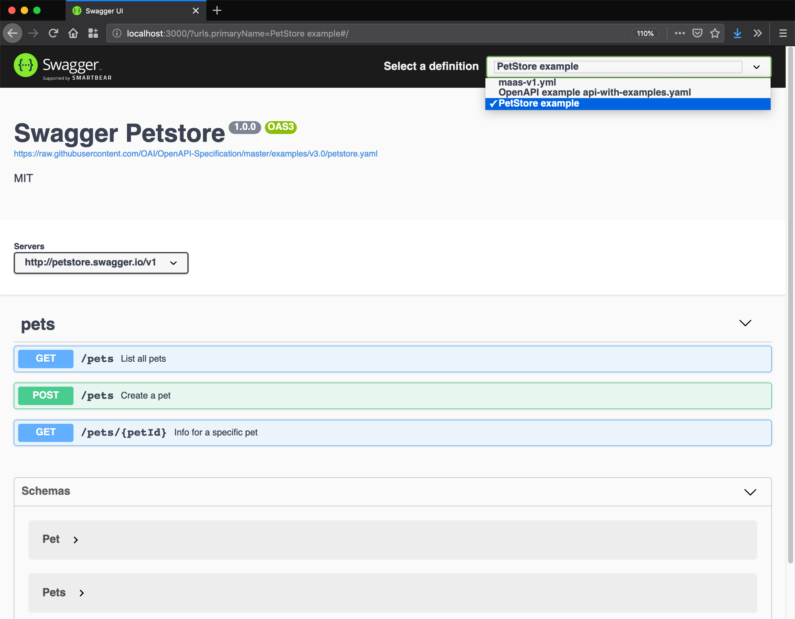

# Display Swagger schemas

Runs SwaggerUI and displays all Swagger Schemas from a folder

## Usage

 * Clone this repo
 * Run `yarn install` to install dependencies
 * Place Swagger or OpenSchema definitions into swagger/ folder
 * Run `yarn start` and open http://localhost:3000 to see SwaggerUI with your definitions

## Links 

  * https://github.com/swagger-api/swagger-ui/blob/master/docs/usage/configuration.md
  * https://www.npmjs.com/package/express-http-proxy
  * https://www.npmjs.com/package/swagger-ui-express2